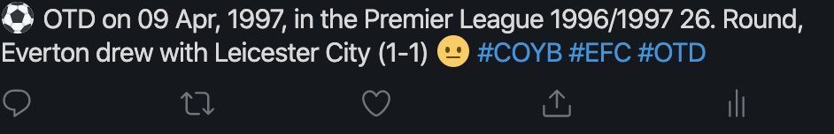

# Goal
This project is a sports headline generator that will look up sports results for a specific team on this day in history, choose one at random and tweet it.

It can be customised to suit any sports team and sports involve two competing teams. The main consideration is sourcing an appropriate dataset and massaging the data into the required format.

An example tweet is:


# Usage
## Pre-requisites
* Python 3.x
* [tweepy library](http://www.tweepy.org/) installed
* [beautiful soup](https://pypi.org/project/beautifulsoup4/) if you want to use some of the helper functions to scrape result data off websites
* A bot account registered with [Twitter](https://developer.twitter.com/en) if you intend to tweet the match directly to twitter
* A suitable data file containing the historic match data

## Data-file format
The data file containing the matches needs to be a csv file with the following data fields per row. Take a look at [test_matches.csv](tests/test_matches.csv) in the tests folder for examples.

* Match date in the format YYYY-m-d e.g. 1980-11-08
* Name of the competition
* Competition round
* Location of the game one of H,A,N
* Opponent
* Result in terms of the team of interest. One of W, L, D
* Final score as n-m in terms of the team of interest e.g. 1-2 would be interepreted as the team of interest lost by 2 goals to 1
* Normal time flag indicating whether the final score was in normal time (NT), after extra time (AET) or a penalty shootout score (PST)
* Match report URL to a webpage that gives a full report on the game

For example, 
```bash
 2020-03-01,Premier League 19/20,Matchday 28,H,Man. Utd.,D,1-1,NT,https://www.premierleague.com/match/46878
```

## Installing the application
1. Create your own [fork of this
  repo](https://help.github.com/articles/fork-a-repo/)
2. Clone it to your machine:
 ```bash
  git clone git@github.com:${YOUR_GITHUB_USERNAME}/otd-sport-headline-tweet.git
  ```

## Configuring the application
[config.py](config.py) contains the various parameters required to generate a headline including the path to the data file and the twitter keys and secrets. Update the parameters to suit you. Note the ENVIRONMENT variable is used to control whether the tweet is sent or not. If ENVIRONMENT is set to DEV then no tweet is sent and the headline is just generated and printed to the terminal.

Make sure you have an appopriate data file containing match scores for your team as described above.

[emoji.csv](data/emoji.csv) contains different emojis that are shown based on a calculated excitement index. This index is calculated from the score of a match with: 
* 4 if the team have won a Final
* 3 being a big win for the team of interest
* 2 is a small win
* 1 is a score draw
* 0 is a nil-nil
* -1 is a small loss
* -3 is a large loss

The file is a csv file with the first column being the excitement index and the second being a string representing the unicode character.

## Running the application
```bash
python3 main.py
```
Will generate a headline which is tweeted automatically (depending on the ENVIRONMENT setting in the config file) and also printed to the terminal.

# Sourcing data
Check out [scrape_data.py](scrape_data.py) for an example of using Beautiful Soup to scrape a website for result data. You can customise this or use it as a basis for authoring your own data sourcing script.

# Deploying to AWS Lambda
Read [docs/deploy_aws.md] (aws deployment) for information on deploying the bot to AWS Lambda.

# Testing the application
There is a test suite that can be executed via pytest. The easiest way to run the tests is via the provided Make file as this also generates coverage data.

To run the tests:
```bash
Make test
```

To run the linters:
```bash
Make lint
```

To clean up:
```bash
Make clean
```

# TODO
* Amend headline to show URL to match report
* Generate more exciting headlines

# License
This project is under the MIT license. See the [LICENSE](LICENSE) file for details
